# Sams-3D-Library
A personal website, made using pure HTML, CSS and Javascript and Unity WebGL to showcase custom made 3D models in an interactive way.

## Table of Contents
1. [Website](#Website)
2. [Information](#Information)
3. [Showcase](#Showcase)
4. [Known Issues](#Known-Issues)
5. [Quick Start](#Quick-Start)
6. [Contribution](#Contribution)

# Website

  <a href="https://sams3dlibrary.com/">
    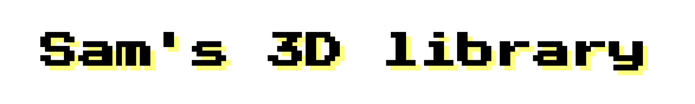
  </a>

# Information

  
<b>Context</b>

   
  This project started in summer 2022 after I had finished two projects for university pertaining to 3D modeling with Blender. I wanted to have my own little place on the web where I could showcase some of the 3D models that I had created for these projects, to ensure that they wouldn't just sit on a hard drive somewhere, never to be seen again. 3D models take a lot of time to create; so in my opinion, they deserve all the attention they can get.
   
   

  
<b>Why HTML, CSS & JavaScript</b>

   
  Initially, I began with just a regular 2D website, which started out as part of some coursework on HTML and CSS. I thought about reworking the website, making heavier use of frameworks such as Bootstrap or others, but deliberately opted not to, in order to get a clearer grasp of HTML, CSS, and JavaScript. <i>I believe it is important to get hands-on experience with any new language first, before efficient use of the frameworks and technologies that build on them can be made.</i>
   
   

  
<b>Unity WebGL Version</b>

   
  During the making of the 2D website, the idea of also creating an interactive WebGL version of the website in Unity randomly popped into my head. I have always been interested in game development, which is why I picked up 3D modeling in the first place some time ago. I felt like adding a Unity WebGL version of the 3D library was simply the natural next step. The 3D Version also has limited mobile support. It will automatically detect if you are on a mobile device and activate a mobile UI letting you play using an onscreen joystick and buttons. <b>The 3D Version Unity Project project can be downloaded <a href="https://drive.google.com/file/d/1dwVfUvqlepKW6kQrtcf_SswvabM8mlvg/view?usp=sharing">here</a>.</b>
   
   

  
<b>Current State</b>

   
  Currently, six 3D models are displayed on the website, all of which can be downloaded/purchased on CGTrader and TurboSquid (or ripped from the files of this repository if you're smart). More 3D models will be uploaded further down the line, some of which can be seen under <a href="#Upcoming-Models">Upcoming Models</a>. I highly appreciate any visits to the <a href="https://sams3dlibrary.com/">Website</a>.
   
   

> ## **Note: Unity WebGL is not officially supported on mobile devices! The experience may vary across devices.**

# Showcase
## 2D Version
<table>
  <tr>
    <td>
      <kbd> 
         
      </kbd>
    </td>
  </tr>
  <tr>
    <td>
      <kbd> 
      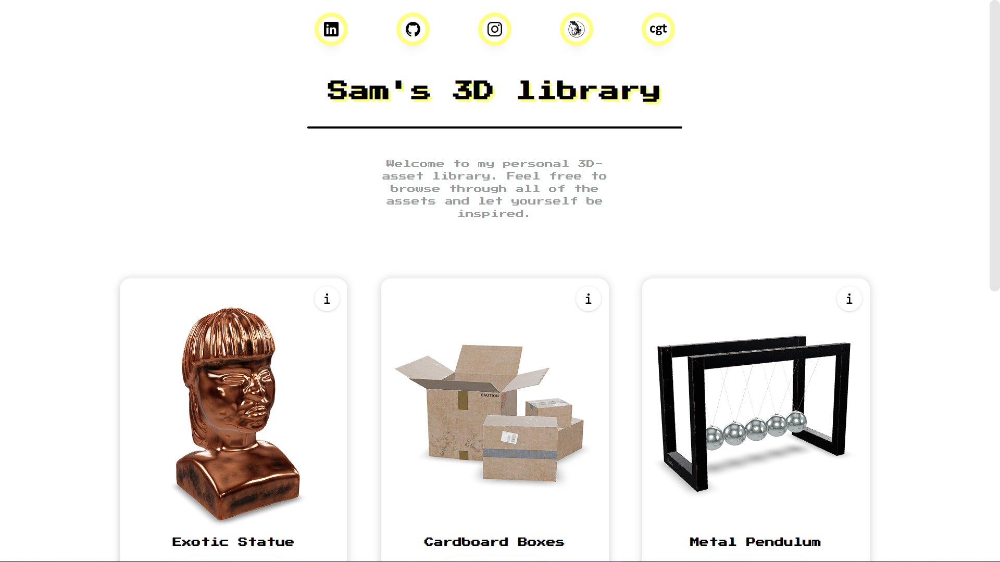 
      </kbd>
    </td>
  </tr>
  <tr>
    <td>
      <kbd>
      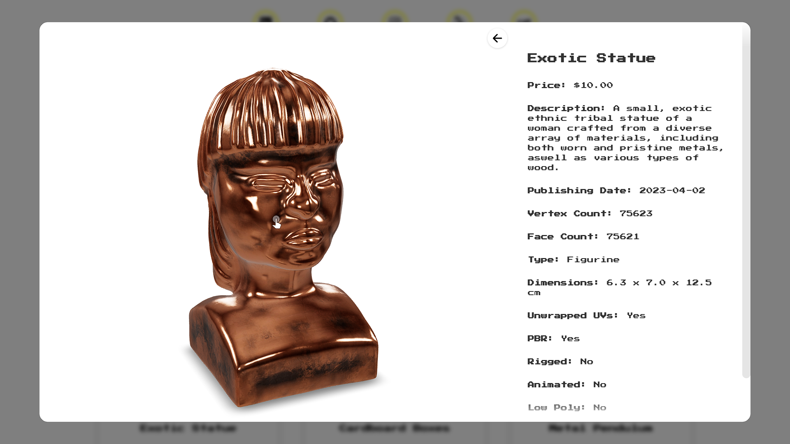 
      </kbd>
    </td>
  </tr>
</table>

 

## 3D Version
<table>
  <tr>
    <td>
      <kbd> 
      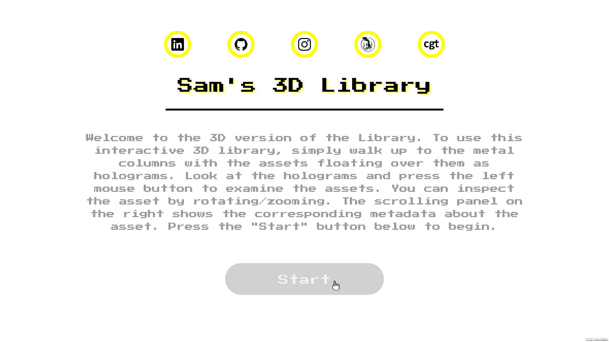 
      </kbd>
    </td>
  </tr>
  <tr>
    <td>
      <kbd> 
      
      </kbd>
    </td>
  </tr>
  <tr>
    <td>
      <kbd>
      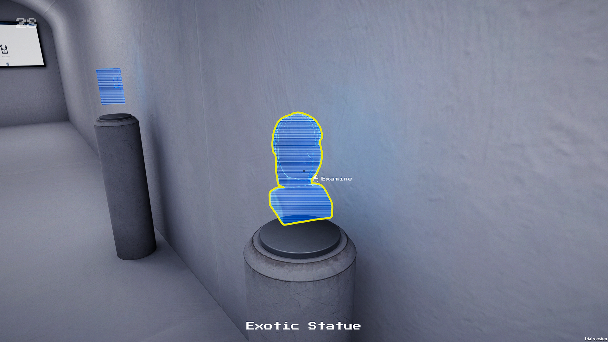
      </kbd>
    </td>
  </tr>
  <tr>
    <td>
      <kbd>
      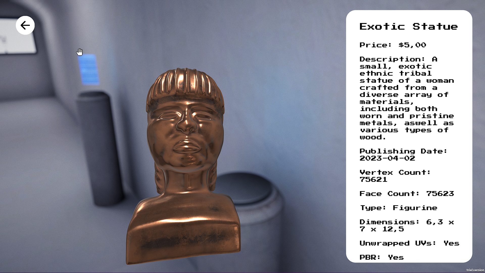
      </kbd>
    </td>
  </tr>
  <tr>
    <td>
      <kbd>
      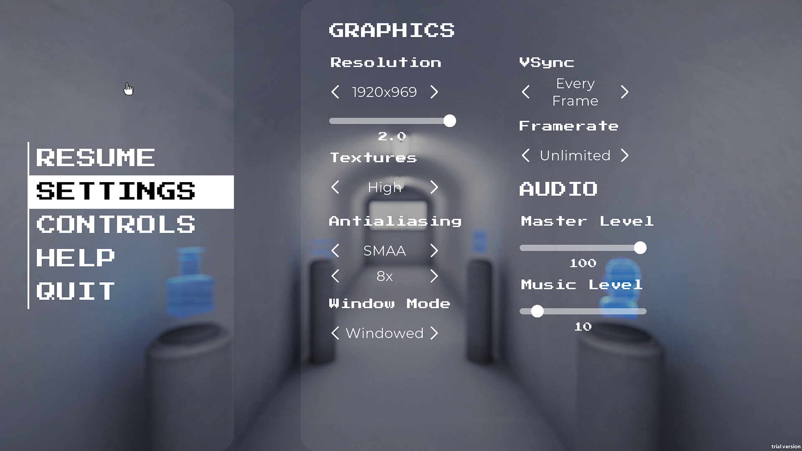
      </kbd>
    </td>
  </tr>
  <tr>
    <td>
      <kbd>
      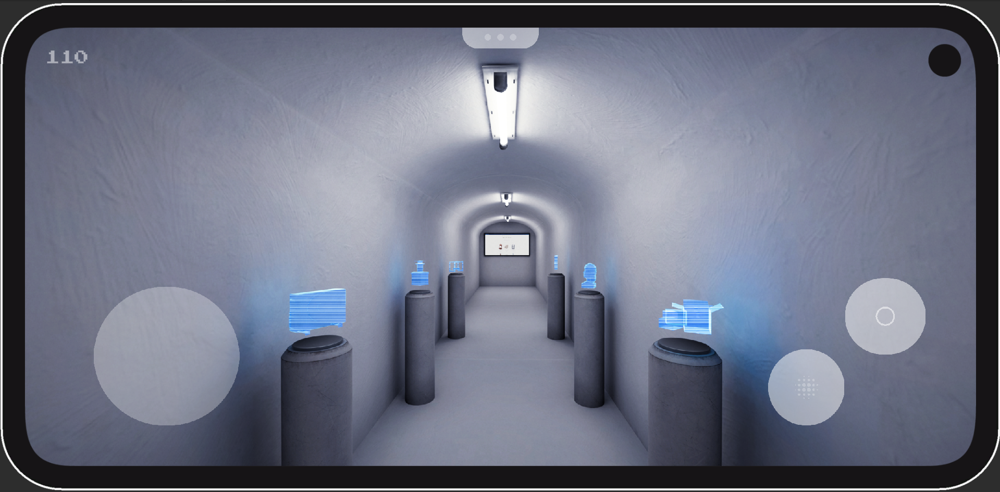
      </kbd>
    </td>
  </tr>
</table>

 

## Upcoming Models
<table>
  <tr>
    <td>
      <kbd> 
        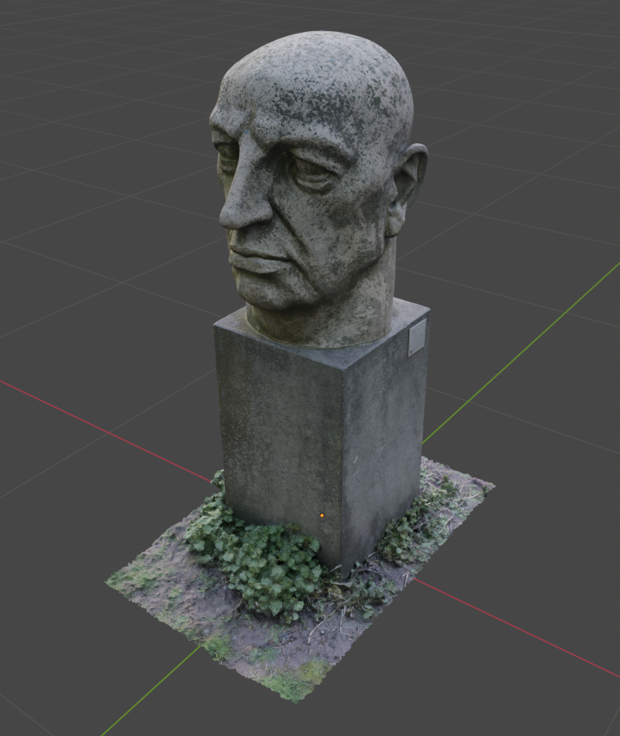 
      </kbd>
    </td>
  </tr>
  <tr>
    <td>
      <kbd> 
        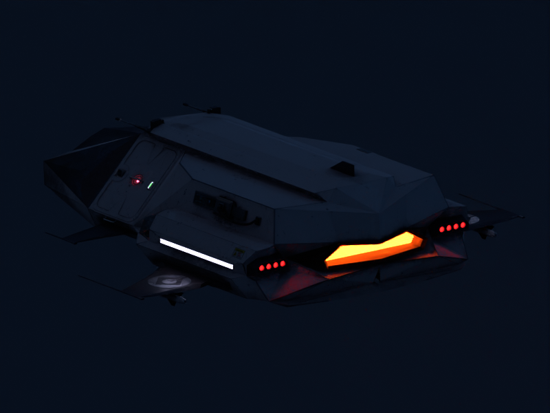 
      </kbd>
    </td>
  </tr>
  <tr>
    <td>
      <kbd> 
        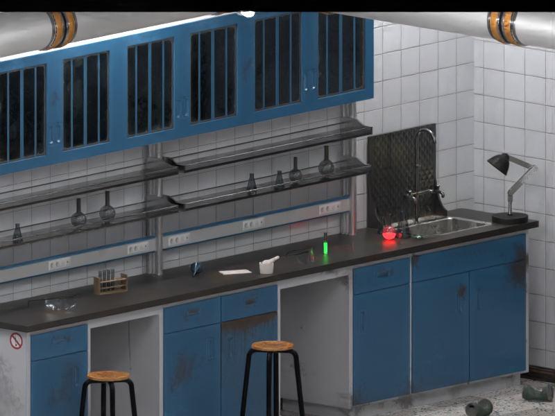 
      </kbd>
    </td>
  </tr>
</table>

 

## Known Issues
### 2D Version

 

### 3D Version
* 3D Version crashes when changing Texture Resolution Slider back and forth
* Window Resolution Setting sometimes causes issues (More or less added for completeness anyways)
* Cursor control will sometimes get handed over back to browser when exiting examination of object. Clicking once will bring control back to the game though.
* On some Mobile Devices and older browsers an error will be shown when trying to play the 3D Version
* On some Mobile Devices a black screen will be shown, or rather, the scene will have no lighting
